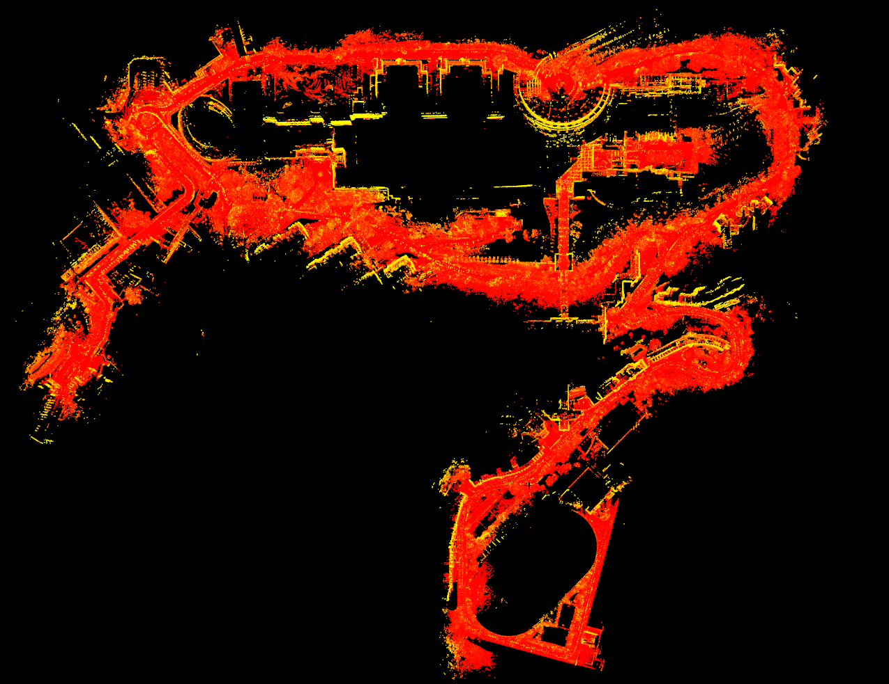
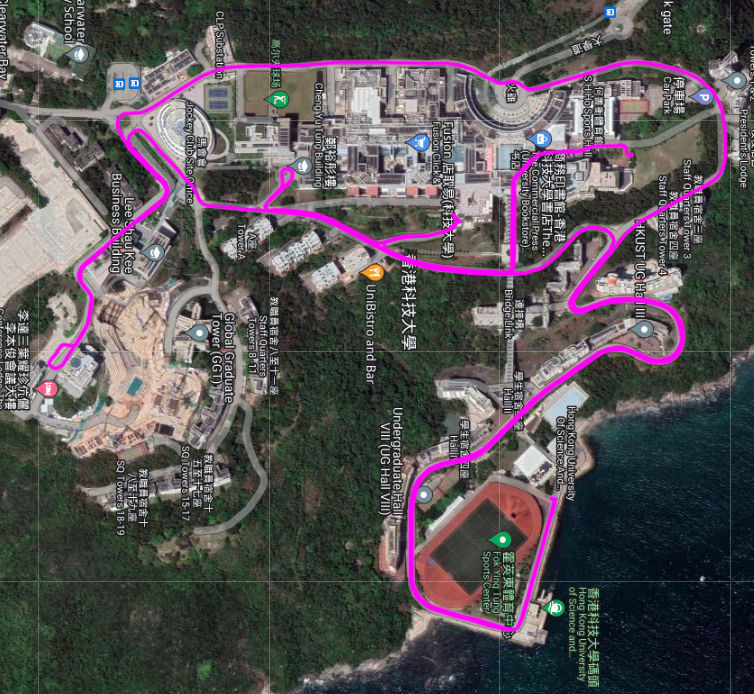
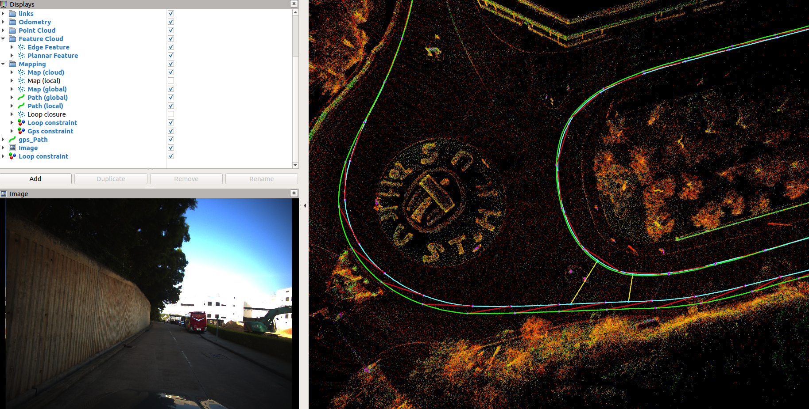
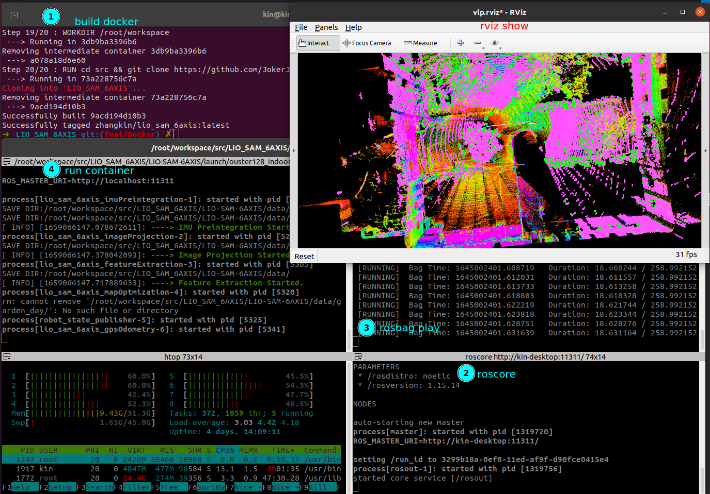
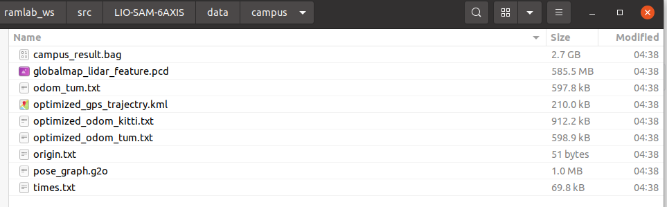

# LIO_SAM_6AXIS

This repo may help to adapt LIO_SAM for your own sensors! 

- support a 6-axis IMU, since the orientation information of IMU is not used in state estimation module.
- support low-cost GNSS, we do not need to adapt for the robot_localization node.
- support the gps constraint visualization module to help debugging the normal GNSS.(the following picture)





## Latest News(2022-07-26)


**new dataset released!** 

# Introduction

LIO_SAM is only designed for 9-axis IMU, for the following reasons.

- the initialization module need absolute orientation to initialize the LIO system.
- the back-end GNSS-based optimization relies on the robot_localization node, and also requires a 9-axis IMU.

Therefore, only minor changes to the original code are required.  which can directly use GPS points of good quality for optimization. Finally, we also made some explanations for some common lidars, as well as coordinate system adaptation and extrinsics between lidars and IMUs, such as Pandar.

we add the gps constraint visualization module to help debugging the normal gps(red lines represents for gps constraint).



# Usage

## Dependences

the same as LIO_SAM.

my previous and current system: 

`Ubuntu18.04 /PCL1.8/GTSAM4.0.2`

`Ubuntu20.04/PCL1.10/GTSAM4.1`

## Video Tutorial

Whether you are running the sample data provided by me or adapting your own sensor, you can watch the detailed teaching video below.

**Video Tutorial**：[Bilibili](https://www.bilibili.com/video/BV1YS4y1i7nX/)、[Youtube](https://youtu.be/TgKSeNLkExc)

## Docker

`Dockerfile` is for people who don't want to break their own environment. Running the algorithm in the docker. Recommend! 

```bash
# please cd the folder which have Dockerfile first, approximately 10mins based on your internet and CPU
docker build -t zhangkin/lio_sam_6axis .

docker run -it --net=host --gpus all --name lio_sam_6axis zhangkin/lio_sam_6axis /bin/zsh

# OR -v to link the folder from your computer into container (your_computer_loc:container_loc)
docker run -it --net=host --gpus all --name lio_sam_6axis -v /home/kin/bag_data:/home/xchu/data/ramlab_dataset zhangkin/lio_sam_6axis /bin/zsh

# in the container
catkin build
source devel/setup.zsh

# with dataset download and linked ==> please see more usage in previous section
roslaunch lio_sam_6axis ouster128_indoors.launch
```

对于在内地的同学，可以换源`dockerhub`后，直接拉取：

```bash
docker pull zhangkin/lio_sam_6axis
```

follow these steps:



## Single Sequence

- hkust_20201105full_correct2

when you set `useGPS` as true,  remember to test the params `gpsCovThreshold`. Just **make sure your vehicles are in a good position at the first beginning of the sequence where the status of GNSS is stable encough**, or you can not initialize your system successfully! see the video.[Gps initialization video](https://www.bilibili.com/video/BV1dY411M7hr/)

```
roslaunch lio_sam_6axis run.launch
```

when you set the `useGPS` true, you may get the following los. It means that these gps points are used for optimization.

```bash
[ INFO] [1651092699.914940274]: curr gps cov: 11.022400, 11.022400 , 176.358400
[ INFO] [1651092700.516013418]: curr gps pose: 13.806815, 7.928380 , 5.147980
[ INFO] [1651092700.516037958]: curr gps cov: 11.022400, 11.022400 , 176.358400
[ INFO] [1651092700.516045476]: curr gps pose: 13.868968, 8.179937 , 4.978980
[ INFO] [1651092700.516052422]: curr gps cov: 11.022400, 11.022400 , 176.358400
```

- garden_day

when you use the **garden_day** rosbag, set your **bag_path** in the **LIO-SAM-6AXIS/launch/ouster128_indoors.launch**.

```bash
roslaunch lio_sam_6axis ouster128_indoors.launch
```

## Batch Scripts

when you want to test on multi-sequence rosbag with the same set of sensor equipment. You just need to modify the script `LIO-SAM-6AXIS/scripts/lio_loop_batch.py`.

1. put all your rosbag info one folder , and set it as the `bag_path_download`params. set your rosbag file name(`bag_path_list`)
2. set your sequence name (`plat_data_pair_list`) 
3. source your workspace(`source devel/setup.zsh` )

4. run the script

```python
python3 src/LIO-SAM-6AXIS/scripts/lio_loop_batch.py
```

## Save Results

I will give the map and related example results constructed based on the instance data using LIO_SAM_6AXIS, once the sharing function of Baidu netdisk is normal.

```bash
rosservice call /lio_sam_6axis/save_map
```

- `campus_result.bag`: inlcude 2 topics, the distorted point cloud and the optimzed odometry

- `odom_tum.txt`

- `optimized_odom_kitti.txt`

- `optimized_odom_tum.txt`

- `pose_graph.g2o`: the final pose graph g2o file

- `globalmap_lidar.pcd`: global map in lidar frame.

- `globalmap_imu.pcd`: global map in IMU body frame, but you need to set proper extrinsics.

- `globalmap_lidar_feature.pcd`: edge+planer points map, based on lidar frame.

- `origin.txt`: The origin of the point cloud map, which can be used for prior map-based localization.  

- `optimized_gps_trajectry.kml`: KML file for optimized trajectory, you can show it in GoogleMaps.



# Dataset and Adaption

#### Velodyne 16 dataset

- hkust_20201105full_correct2，[dropbox](https://drive.google.com/file/d/1bGmIll1mJayh5_2LokoshVneUmJ6ep00/view)  or [BaiduNetdisk](https://pan.baidu.com/s/1il01D0Ea3KgfdABS8iPHug) (password: m8g4).

​		See [this doc](doc/adaption.md).

#### Pandar dataset

- [HILTI DATASET](https://hilti-challenge.com/dataset-2022.html).

The [config/params_pandar.yaml](https://github.com/JokerJohn/LIO_SAM_6AXIS/blob/main/LIO-SAM-6AXIS/config/params_pandar.yaml) is prepared for the HILTI sensors kit, so you can run it direcly!

#### Ouster dataset

- [garden_day](https://hkustconnect-my.sharepoint.com/:u:/g/personal/xhubd_connect_ust_hk/EQavWMqsN6FCiKlpBanFis8Bci-Mwl3S_-g1XPrUrVFB9Q?e=lGEKFE)

  when you download this compressed data, remember to execute the following command

  ```bash
  rosbag decompress 20220216_garden_day_ref_compressed.bag
  ```

# Related Package

#### 1. [LIO-SAM-6AXIS-UrbanNav](https://github.com/zhouyong1234/LIO-SAM-6AXIS-UrbanNav)

- LIO_SAM 6轴IMU适配香港城市数据集UrbanNav，并给出添加GPS约束和不加GPS约束的结果

#### 2. [LIO-SAM-6AXIS-INTENSITY](https://github.com/JokerJohn/LIO-SAM-6AXIS-INTENSITY)

- integrate [LIO-SAM](https://github.com/TixiaoShan/LIO-SAM) and [Imaging_lidar_place_recognition](https://github.com/TixiaoShan/imaging_lidar_place_recognition) to achieve better mapping and localization result for SLAM system. 

# TO DO

1. colored point cloud  map
2. dynamic object removal
3. Using GNSS Raw Observations

As soon as I have time I will continue to update this repo and release more data.

# Star History

[](https://star-history.com/#JokerJohn/LIO_SAM_6AXIS&Date)

# Acknowledgments

Thanks to  [Guoqing Zhang](https://github.com/MyEvolution), [Jianhao Jiao](https://github.com/gogojjh).

Thanks to [LIO_SAM](https://github.com/TixiaoShan/LIO-SAM).


