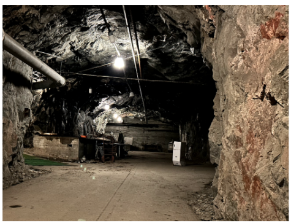

# LIO_SAM_6AXIS

LIO_SAM_6AXIS is an open-source SLAM project based on the  project [LIO_SAM](https://github.com/TixiaoShan/LIO-SAM)   that has been modified to support a wider range of sensors. It includes support for a 6-axis IMU and low-cost GNSS, making it easier to adapt for your own sensor setup.


## Features

  LIO_SAM_6AXIS includes the following features:

  - Support for a 6-axis IMU: This allows you to use orientation information in state estimation, improving the accuracy of your results.
  - Support for low-cost GNSS: By eliminating the need to adapt for the robot_localization node, this feature makes it easier to integrate GNSS into your SLAM system.
  - GPS constraint visualization: This feature helps with debugging by allowing you to visualize the GPS constraints that are being used in the optimization.
  - Compatible with a range of lidars: LIO_SAM_6AXIS can be adapted to work with a range of lidars, including popular models like the VLP-16 ，Pandar32 and Ouster OS-1.
  - Easy to adapt: With minor changes to the original code, LIO_SAM_6AXIS can be adapted to work with your own sensors and lidars.

## Getting Started

To get started with LIO_SAM_6AXIS, follow these steps:

1. Clone the repository:

```bash
git clone https://github.com/JokerJohn/LIO_SAM_6AXIS.git
```

2. Install the dependencies:

```bash
cd LIO_SAM_6AXIS
catkin build
```

3. Launch the roslaunch file for your sensor setup:

```bash
# set your bag_path here
roslaunch lio_sam_6axis test_vlp16.launch
```

For more information on how to use LIO_SAM_6AXIS, see the video tutorial and documentation.

4. finally, save your point cloud map.

```bash
# map is in the LIO-SAM-6AXIS/data 
rosservice call /lio_sam_6axis/save_map
```


5. for docker support.

`Dockerfile` is for people who don't want to break their own environment.

```bash
# please cd the folder which have Dockerfile first, approximately 10mins based on your internet and CPU
docker build -t zhangkin/lio_sam_6axis .

docker run -it --net=host --gpus all --name lio_sam_6axis zhangkin/lio_sam_6axis /bin/zsh

# OR -v to link the folder from your computer into container (your_computer_loc:container_loc)
docker run -it --net=host --gpus all --name lio_sam_6axis -v /home/kin/bag_data:/home/xchu/data/ramlab_dataset zhangkin/lio_sam_6axis /bin/zsh

# in the container
catkin build
source devel/setup.zsh

# with dataset download and linked ==> please see more usage in previous section
roslaunch lio_sam_6axis ouster128_indoors.launch

# 对于在内地的同学，可以换源`dockerhub`后，直接拉取：
docker pull zhangkin/lio_sam_6axis
```

## Documentation

The documentation for LIO_SAM_6AXIS can be found in the `doc` directory of the repository. It includes instructions on how to adapt the code for your own sensors and lidars.

- [Bilibili](https://www.bilibili.com/video/BV1YS4y1i7nX/)
- [Youtube](https://youtu.be/TgKSeNLkExc)

## Latest News(2024-04-25)

Here are the latest updates to LIO_SAM_6AXIS:

- Add support for Velodyne Velarray M1600 [#75](https://github.com/JokerJohn/LIO_SAM_6AXIS/pull/75) from [pedrotomas27](https://github.com/)

   

## Dataset and Adaptation

LIO_SAM_6AXIS is compatible with a range of datasets and sensor setups. To help you get started, we have included a table that lists some of the datasets and sensors that have been tested with LIO_SAM_6AXIS.

| Dataset                                                      | Description                                                  | Sensors                                           | Download Links                                               | Ground Truth                                                 | Comments                                                     |
| ------------------------------------------------------------ | ------------------------------------------------------------ | ------------------------------------------------- | ------------------------------------------------------------ | ------------------------------------------------------------ | ------------------------------------------------------------ |
| hkust_20201105full                                           |  | VLP-16, STIM300 IMU, left camera, normal GPS      | [Dropbox](https://drive.google.com/file/d/1bGmIll1mJayh5_2LokoshVneUmJ6ep00/view), [BaiduNetdisk](https://pan.baidu.com/s/1il01D0Ea3KgfdABS8iPHug) (password: m8g4) | [GT](https://hkustconnect-my.sharepoint.com/:t:/g/personal/xhubd_connect_ust_hk/ESoJj5STkVlFrOZruvEKg0gBasZimTC2HSQ2kqdIOWHiGg?e=TMtrz6) (password:123) | About 10 km outdoor, see [this doc](https://chat.openai.com/doc/adaption.md) |
| [HILTI](https://hilti-challenge.com/dataset-2022.html) DATASET 2022 |                    | Hesai32 lidar, low-cost IMU, 5 Fisher Eye cameras | [Download](https://hilti-challenge.com/dataset-2022.html)    |                                                              | The [config/params_pandar.yaml](https://github.com/JokerJohn/LIO_SAM_6AXIS/blob/main/LIO-SAM-6AXIS/config/params_pandar.yaml) is prepared for the HILTI sensors kit |
| [FusionPortable](https://ram-lab.com/file/site/fusionportable/dataset/fusionportable/) DATASET |                                  | Ouster OS1-128, STIM300 IMU, stereo camera        | [Download](https://hkustconnect-my.sharepoint.com/:u:/g/personal/xhubd_connect_ust_hk/EQavWMqsN6FCiKlpBanFis8Bci-Mwl3S_-g1XPrUrVFB9Q?e=lGEKFE) | [GT](https://hkustconnect-my.sharepoint.com/:t:/g/personal/xhubd_connect_ust_hk/Ea-e6VPaa59Br-26KAQ5IssBwjYcoJSNOJs0qeKNZVeg1w?e=ZjrHx4) | Indoors. When you download this compressed data, remember to execute the following command: `rosbag decompress 20220216_garden_day_ref_compressed.bag` |
| [Multimodal Dataset](https://zenodo.org/records/7913307)     |  | MS1600                                            | [Download](https://zenodo.org/records/7913307)               |                                                              | Multimodal Dataset from Harsh Sub-Terranean Environment with Aerosol Particles for Frontier Exploration |

## Related Package

### 1. [LIO-SAM-6AXIS-UrbanNav](https://github.com/zhouyong1234/LIO-SAM-6AXIS-UrbanNav)

- LIO_SAM 6轴IMU适配香港城市数据集UrbanNav，并给出添加GPS约束和不加GPS约束的结果

### 2. [LIO-SAM-6AXIS-INTENSITY](https://github.com/JokerJohn/LIO-SAM-6AXIS-INTENSITY)

- integrate [LIO-SAM](https://github.com/TixiaoShan/LIO-SAM) and [Imaging_lidar_place_recognition](https://github.com/TixiaoShan/imaging_lidar_place_recognition) to achieve better mapping and localization result for SLAM system. 

## Credits

We would like to thank TixiaoShan for creating the LIO_SAM project that served as the foundation for this work.

## Acknowledgments

Our deep gratitude goes to [pedrotomas27](https://github.com/),  [Guoqing Zhang](https://github.com/MyEvolution), [Jianhao Jiao](https://github.com/gogojjh), [Jin Wu](https://github.com/zarathustr), and [Qingwen Zhang](https://github.com/Kin-Zhang) for their invaluable contributions to this project. A special mention goes to the [LIO_SAM](https://github.com/TixiaoShan/LIO-SAM)  for laying the groundwork for our efforts. We also thank the open-source community, whose relentless pursuit of SLAM technology advancement has made this project possible.


