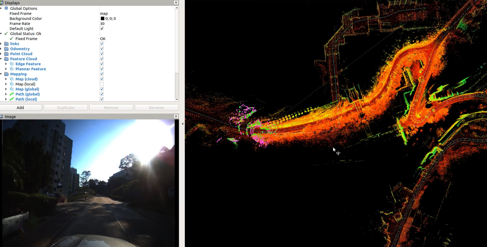
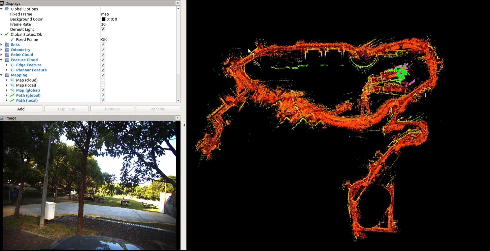
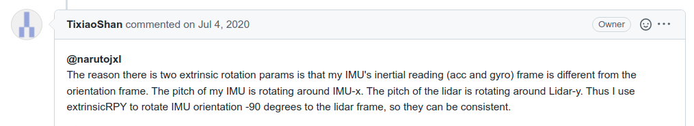
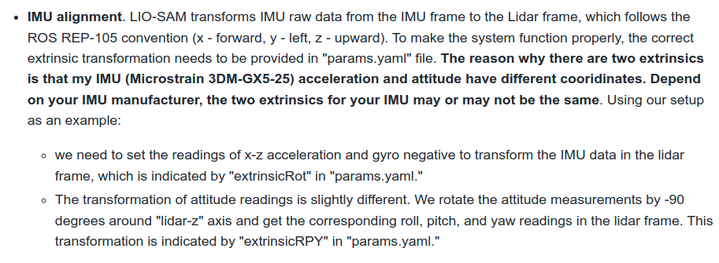

## Dataset

We provided a very challenging long-distance vehicle dataset. You can get the campus data in  [dropbox](https://drive.google.com/file/d/1bGmIll1mJayh5_2LokoshVneUmJ6ep00/view)  or [BaiduNetdisk](https://pan.baidu.com/s/1il01D0Ea3KgfdABS8iPHug) (password: m8g4).

- more than 10km.

- the campus is on a mountain, and the data is collected from the mountainside to the top of the mountain and finally to the foot of the mountain, and there is a large elevation change.

- there is a tunnel scene collected in the mountain campus at the beginning. It's hard for us to initialize the LIO system with GNSS. 

 > In the tunnel, the LIO is degraded, and the drift is large. GPS data within a short distance before and after entering or leaving the tunnel cannot be trusted, because GPS takes a certain amount of time to converge, so **an incorrect covariance threshold may cause the pose graph to introduce more error constraints**, as shown in the following figure(the red lines in the tunnel maybe wrong constrains).
 > 

- The data quality of the initial GPS mainly is poor, and there are large and small closed loops.

> in this case, only use the radius search method, the LIO_SAM can not find the big loop without GPS.
>
> 

We ensure that the coordinate systems of the lidar and IMU are consistent, and it is easy to set the extrinsic matrix.


Using the campus data, we provide the test videos. 

- when we do not use gps, the LIO_SAM can not loop successfully! see the video here [Youtube](https://youtu.be/IRM9Ws2C7R8)，[Bilibili](https://www.bilibili.com/video/BV1hi4y1m7c7?spm_id_from=333.999.0.0). 



- when we use GPS, LIO_SAM show good performance, especially for the loop clouser. see the videos here [Youtube](https://youtu.be/Jfj69AoPXao)，[Bilibili](https://www.bilibili.com/video/BV1o541117sr/?spm_id_from=333.788).


## Adaptation for 6-axis IMU

#### 1.align the coordinate system between IMU and Lidar

Before we align the coordinate systems of the IMU and lidar, that is, set the three parameters `extrinsicTrans`, `extrinsicRot` and `extrinsicRPY` in the `LIO-SAM-6AXIS/config/params.yaml` file. Many people have questions about the latter two rotation extrinsic parameters, why There will be two different values for the external participation of the lidar to the IMU. The author's reply is directly posted below.





In short, the lidar coordinate system should comply with the REP105 standard, that is, to ensure that the lidar coordinate system xyz represents the direction, front、left and upper. The following will take the Hesai radar coordinate system as an example to illustrate.

#### 2.modify the `6AXIS/include/utility.h` file

Because LIO_SAM only uses the acceleration and angular velocity in the IMU data to estimate the system state, and its orientation data only initializes the orientation of the system in the back-end optimization module, it is very simple to adapt to the 6-axis IMU. On the premise that the IMU coordinate system and the lidar coordinate system are aligned, it is only necessary to modify the imuConverter function. The specific method is to modify the `imuConverter` function in the `LIO-SAM-6AXIS/include/utility.h` file, as follows.

```c++
  sensor_msgs::Imu imuConverter(const sensor_msgs::Imu &imu_in) {
    sensor_msgs::Imu imu_out = imu_in;
    // rotate acceleration
    Eigen::Vector3d acc(imu_in.linear_acceleration.x, imu_in.linear_acceleration.y, imu_in.linear_acceleration.z);
    acc = extRot * acc;
    imu_out.linear_acceleration.x = acc.x();
    imu_out.linear_acceleration.y = acc.y();
    imu_out.linear_acceleration.z = acc.z();
    // rotate gyroscope
    Eigen::Vector3d gyr(imu_in.angular_velocity.x, imu_in.angular_velocity.y, imu_in.angular_velocity.z);
    gyr = extRot * gyr;
    imu_out.angular_velocity.x = gyr.x();
    imu_out.angular_velocity.y = gyr.y();
    imu_out.angular_velocity.z = gyr.z();
    // rotate roll pitch yaw
    Eigen::Quaterniond q_from(imu_in.orientation.w, imu_in.orientation.x, imu_in.orientation.y, imu_in.orientation.z);
    // we only need to align the coordinate system.
    // Eigen::Quaterniond q_final = q_from * extQRPY;
    Eigen::Quaterniond q_final = extQRPY;
    q_final.normalize();
    imu_out.orientation.x = q_final.x();
    imu_out.orientation.y = q_final.y();
    imu_out.orientation.z = q_final.z();
    imu_out.orientation.w = q_final.w();

    if (sqrt(
        q_final.x() * q_final.x() + q_final.y() * q_final.y() + q_final.z() * q_final.z() + q_final.w() * q_final.w())
        < 0.1) {
      ROS_ERROR("Invalid quaternion, please use a 9-axis IMU!");
      ros::shutdown();
    }

    return imu_out;
  }
```

`q_final` represents the orientation result taken from the IMU data. For the 6-axis IMU, we generally integrate our own in the SLAM system instead of directly adopting this result. But in the 9-axis IMU, the orentation part is the global attitude, that is, the result of the fusion with the magnetometer, which represents the angle between the IMU and the magnetic north pole. So here we only need to align the coordinate axis of the orentation data with the base_link, that is, multiply the lidar to the extrinsic of the IMU.

## Adaptation for different types of lidar

Make sure the point cloud timestamp, ring channel is ok. In addition, the lidar coordinate system should meet the REP105 standard, that is, xyz represents the front and upper right direction. Note that the structure of the point cloud is related to your lidar driver, and may not be exactly the same. The format below is for reference only.

### POINT_CLOUD_REGISTER_POINT_STRUCT

You need to add some specific point cloud struct for your own lidar  in the `imageProjection.cpp`. 


#### Pandar

The coordinate system of Hesai LiDAR is different from that of the traditional REP105, and its xyz represent the left 、back and top respectively.

```c++
struct PandarPointXYZIRT {
  PCL_ADD_POINT4D
  float intensity;
  double timestamp;
  uint16_t ring;                      ///< laser ring number
  EIGEN_MAKE_ALIGNED_OPERATOR_NEW // make sure our new allocators are aligned
} EIGEN_ALIGN16;

POINT_CLOUD_REGISTER_POINT_STRUCT(PandarPointXYZIRT,
(float, x, x)
(float, y, y)
(float, z, z)
(float, intensity, intensity)
(double, timestamp, timestamp)
(uint16_t, ring, ring)
)
```

We strongly recommend that **you first adjust the coordinate system of the pandar lidar (because it is the most special) to be consistent with the REP105**, and then adjust the LIDAR2IMU extrinsincs. You just need to modify the `cachePointCloud` function in `imageProjection.cpp`

```c++
    if (sensor == SensorType::VELODYNE || sensor == SensorType::LIVOX) {
      pcl::moveFromROSMsg(currentCloudMsg, *laserCloudIn);
    } else if (sensor == SensorType::OUSTER) {
      // Convert to Velodyne format
      pcl::moveFromROSMsg(currentCloudMsg, *tmpOusterCloudIn);
      laserCloudIn->points.resize(tmpOusterCloudIn->size());
      laserCloudIn->is_dense = tmpOusterCloudIn->is_dense;
      for (size_t i = 0; i < tmpOusterCloudIn->size(); i++) {
        auto &src = tmpOusterCloudIn->points[i];
        auto &dst = laserCloudIn->points[i];
        dst.x = src.x;
        dst.y = src.y;
        dst.z = src.z;
        dst.intensity = src.intensity;
        dst.ring = src.ring;
        //dst.time = src.t * 1e-9f;
        dst.time = src.time;
      }
    } else if (sensor == SensorType::HESAI) {
      // Convert to Velodyne format
      pcl::moveFromROSMsg(currentCloudMsg, *tmpPandarCloudIn);
      laserCloudIn->points.resize(tmpPandarCloudIn->size());
      laserCloudIn->is_dense = tmpPandarCloudIn->is_dense;
      double time_begin = tmpPandarCloudIn->points[0].timestamp;
      for (size_t i = 0; i < tmpPandarCloudIn->size(); i++) {
        auto &src = tmpPandarCloudIn->points[i];
        auto &dst = laserCloudIn->points[i];
        // please note that pandar frame: X Y Z ->  left back top
        // so when you transform it, the newly X0 maybe -Y, Y0 = X, Z keep the same
        // you can also multiply a rotation matrix
        dst.x = src.y * -1;
        dst.y = src.x;
        //        dst.x = src.x;
        //        dst.y = src.y;
        dst.z = src.z;
        dst.intensity = src.intensity;
        dst.ring = src.ring;
        dst.time = src.timestamp - time_begin; // s
      }
    } else {
      ROS_ERROR_STREAM("Unknown sensor type: " << int(sensor));
      ros::shutdown();
    }
```

Now your lidar base_link  is REP105 standard, you just need to regard it as a Velodyne lidar to adjust the extrinsincs between IMU. Here is my notes.


#### Ouster

The point cloud timestamp of ouster lidar is not necessarily ustc time. **Note the data type and order of the time channel.**

```c++
struct OusterPointXYZIRT {
  PCL_ADD_POINT4D;
  float intensity;
    // some people may modity the driver when they use the ouster lidar
	//  uint32_t time;
  uint16_t reflectivity;
  uint8_t ring;
  std::uint16_t ambient; 
  float time;
  uint16_t noise;
  uint32_t range;
  EIGEN_MAKE_ALIGNED_OPERATOR_NEW
} EIGEN_ALIGN16;

POINT_CLOUD_REGISTER_POINT_STRUCT(OusterPointXYZIRT,
(float, x, x) (float, y, y) (float, z, z) (float, intensity, intensity)
(uint16_t, reflectivity, reflectivity)
(uint8_t, ring, ring)
(std::uint16_t, ambient, ambient)
(float, time, time)
(uint16_t, noise, noise)
(uint32_t, range, range)
)
```

### Time Units

Then you can set the `debugLidarTimestamp` to debug the timestamp of each points. Please note that the point cloud timestamp unit output by the terminal is **seconds**, and **the value is between 0.0-0.1s**. Since the time for mechanical lidar to scan a circle to obtain a point cloud is usually 0.1s.

```
if (debugLidarTimestamp) {
  std::cout << std::fixed << std::setprecision(12) << "end time from pcd and size: "
            << laserCloudIn->points.back().time
            << ", " << laserCloudIn->points.size() << std::endl;
}
```

# 